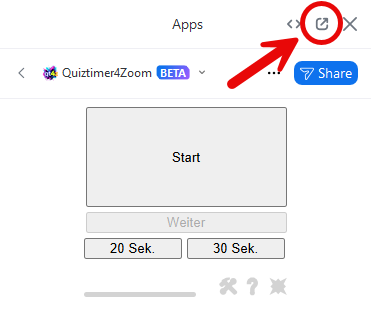
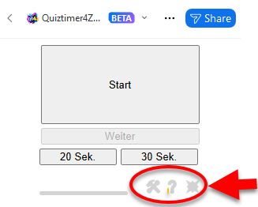
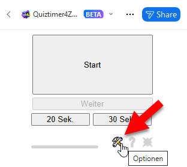
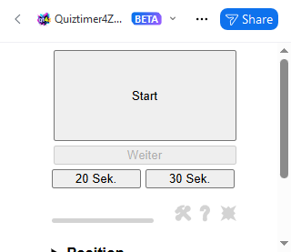
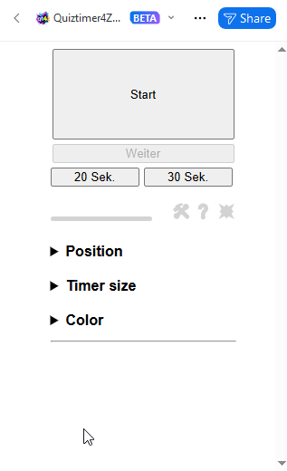
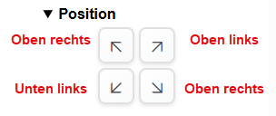
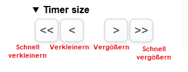
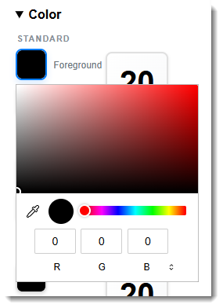
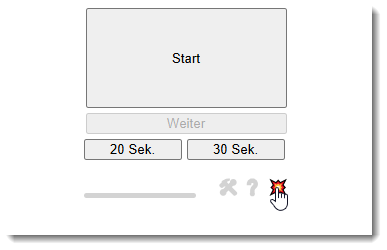

# Quiztimer4Zoom

## ➡️ Beschreibung
Bisher kann man in einem Zoom-Meeting nur einen Quiztimer einblenden, indem man ein Windows-Programm benutzt ([hier](https://www.comsoweb.de/product/?dqv-timer-fuer-online-liga) oder [hier](https://elektroelch.de/quiztimer/)) und dieses über [OBS](https://obsproject.com) in Zoom einblendet. Das klingt nicht nur kompliziert, sondern funktioniert auch nicht überall ohne Probleme.

> **Mit Quiztimer4Zoom kann man einen Timer direkt aus Zoom heraus einblenden**. 🎉

## ➡️ Installation
**Quiztimer4Zoom** wird als App in Zoom installiert. Er befindet sich noch in der Beta-Phase, deshalb kann man in noch nicht über den Marketplace installen. Stattdessen musst Du einfach nur auf den folgenden Knopf klicken:

 <a href="https://quiztimer4zoom.vercel.app/install" target="_blank">Quiztimer4Zoom installieren</a>

Darauf hin öffnet sich ein neuer Tab:

Hier muss man zustimmen, dass Quiztimer4Zoom mit folgenden in Zoom installiert werden darf, ansonsten kann man die App nicht benutzen. 

Hat man den Bedingungen zugestimmt, so öffnet sich eine weitere Seite:

Wenn Du Deinem Brwoser bereits die Erlaubnis gegeben hast, Zoom automatisch zu öffnen, dann wird jetzt Zoom gestartet. Ansonst öffnet sich eine Meldung, die je nach Browser ungefähr so aussieht:

Hier bitte "Öffnen" anklicken. 

Es öffnet sich die Zoom-App im Zoom-Fenster. Sollte kein Meeting laufen, so öffnet sich der Apps-Tab, 

## ➡️ Benutzung

### Vom Hauptfenster trennen
Damit man den Timer benutzen kann, wenn das Chatfenster geöffnet ist, muss man s vom Hauptfenster trennen. Dafür klickt man im Kopf der App auf das Quadrat mit dm Pfeil:

### Benutzeroberfläche
Das Interface ist so einfach wie möglich gehalten und besteht aus 4 Schaltflächen:
+ Start/Stop
+ Weiter
+ 20 Sek
+ 30 Sek
 
### Timer starten und stoppen
Der Timer wird durch Betätigen des Startknopfs gestartet. Aus dem Startknopf ist jetzt ein Stopknopf geworden.

Jetzt bestehen verschiedene Möglichkeiten:
+ Man lässt die Zeit bis Null herunterzählen.   
Ist die Zeit abgelaufen, so kann wird aus dem Stopknopf ein Startknopf und man kann den Timer sofort wieder von vorne starten. Startet man den Timer nicht neu, so wird nach den 5 Sekunden die Zeit automatisch wieder auf die Startzeit zurückgesetzt.
+ Man stoppt die Zeit durch drücken auf den Stopknopf.  
 Jetzt startet ebenfalls der Countdown. Innerhalb dieser Zeit kann man durch drücken des "Weiter"-Knopf den Zähler erneut bei der angehaltenen Zeit starten. Nach Ablauf der 5 Sekunden wird der Timer automatisch auf die Startzeit zurückgesetzt.
 
## ➡️ Optionen
Unter den Bedienknöpfen befindet sich eine Reihe von ausgegrauten Elementen:

Fährt man mit der Maus über diese Elemente, so werden diese farbig. 

Das linke Element öffnet die Optionen:

Leider ist es nicht möglich, das Fenster automatisch zu vergrößern. Deshalb musst du die Fenstergröße händisch ändern:

Jetzt kann man drei Einstellungen durch klicken auf die Überschriften ändern:
+ Die Position des Timers
+ Die Größe des Timers
+ Die Farben des Timers

Die geänderten Werte werden automatisch gespeichert.

### Position
Es können vier verschiedene Positionen gewählt werden:
+ Oben links
+ Oben rechts
+ Unten links
+ Unten rechts

### Größe
Die Größe des Timers lässt sich in Schritten von einem (> oder <) und fünf (>> oder <<) Pixeln ändern. Die Änderungen werden sofort angezeigt.

### Farben
Hier lassen sich die Farben des Timers ändern. Man kann die Farben für die Standardanzeige, die letzten fünf Sekunden und für den abgelaufenen Timer ändern.

Durch Klicken auf eine der Flächen auf der linken Seite wird ein Farbauswähler geöffnet. Nachdem man sich eine Farbe ausgewählt hat, klickt man außerhalb des Farbauswählers. Die Änderung wird in den Beipsiel-Timern auf der rechten Seite angezeigt.
Die Änderungen werden automatisch gespeichert.

### Optionen schließen
Durch erneutes Klicken auf das ausgegraute Optionselement werden die Optionen wieder geschlossen. Die Größe des Fensters kann leider nicht automatisch geändert werden.

## ➡️ Der Panik-Button
Beim Quiztimer4Zoom handelt es sich um eine Beta-Version. Es funktioniert daher nicht alles reibungslos. Der häufigste Fehler ist ein Problem der Darstellung des Timers im Video.
Falls dies passieren sollte, kann man den "Panik-Knopf" auf der rechten Seite der ausgegrauten Elemente klicken:

Daraufhin sollte sich die Timer-Element neu aufbauen.

## ➡️ Einschränkungen
* Linux unterstützt keine Zoom-Apps 

<h2>Quiztimer4Zoom entfernen</h2>

