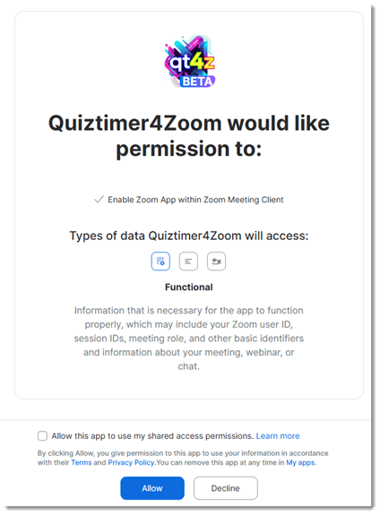
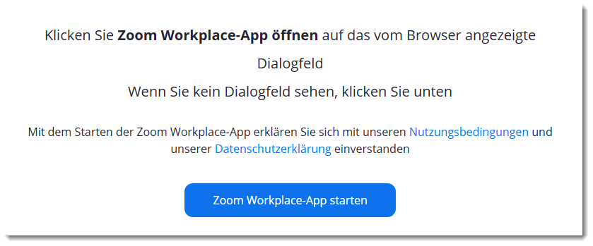
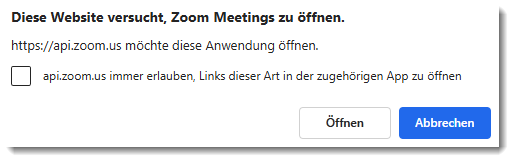

<h1>Quiztimer4Zoom!</h1>

<h2>Beschreibung</h2>
Bisher kann man in einem Zoom-Meeting nur einen Quiztimer einblenden, indem man ein Windows-Programm benutzt ([hier](https://www.comsoweb.de/product/?dqv-timer-fuer-online-liga) oder [hier](https://elektroelch.de/quiztimer/)) und dieses über [OBS](https://obsproject.com) in Zoom einblendet. Das klingt nicht nur kompliziert, sondern funktioniert auch nicht überall ohne Probleme.
.
> **Mit Quiztimer4Zoom kann man einen Timer direkt aus Zoom heraus einblenden**. 🎉

<h2>Installation</h2>
**Quiztimer4Zoom** wird als App in Zoom installiert. Er befindet sich noch in der Beta-Phase, deshalb kann man in noch nicht über den Marketplace installen. Stattdessen musst Du einfach nur auf den folgenden Knopf klicken:

 <a href="https://quiztimer4zoom.vercel.app/install" target="_blank">Quiztimer4Zoom installieren</a>

Darauf hin öffnet sich ein neuer Tab:

Hier muss man zustimmen, dass Quiztimer4Zoom mit folgenden in Zoom installiert werden darf, ansonsten kann man die App nicht benutzen. 

Hat man den Bedingungen zugestimmt, so öffnet sich eine weitere Seite:

Wenn Du Deinem Brwoser bereits die Erlaubnis gegeben hast, Zoom automatisch zu öffnen, dann wird jetzt Zoom gestartet. Ansonst öffnet sich eine Meldung, die je nach Browser ungefähr so aussieht:

Hier bitte "Öffnen" anklicken. 

Es öffnet sich die Zoom-App. Sollte kein Metting laufen, so öffnet sich der Apps-Tab, 

## Benutzung

Das

<h2>Einschränkungen</h2>
* Linux unterstützt keine Zoom-Apps 

<h2>Quiztimer4Zoom entfernen</h2>
How to remove an app from Zoom App Marketplace
Open and sign in to Zoom App Marketplace.
In the top right corner, click Manage.
On the left side of the page, click Added Apps.
A list of all apps added by you is displayed.
Identify the app to be removed then, click Remove.
A Remove App window will appear.
(Optional) Click the drop-down menu to choose the reason for removing this app.
Click Remove to confirm the removal of this app.

---

