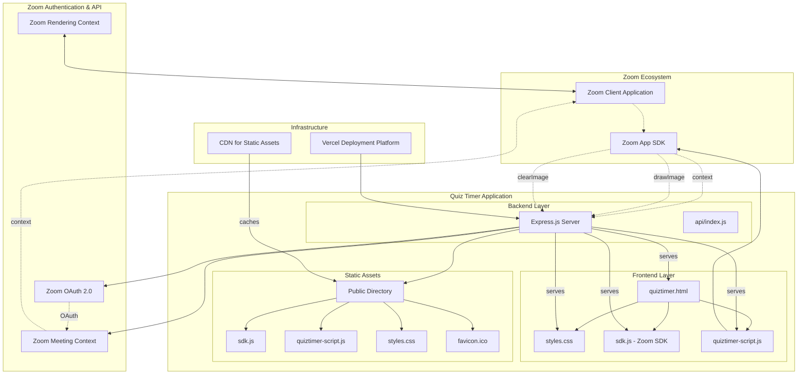
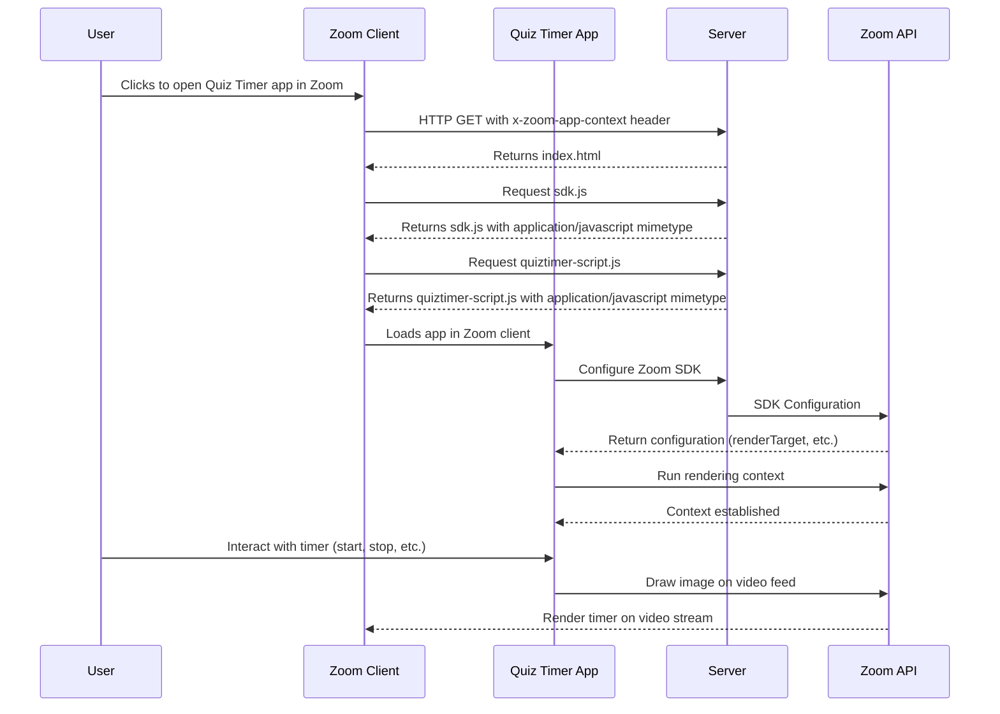
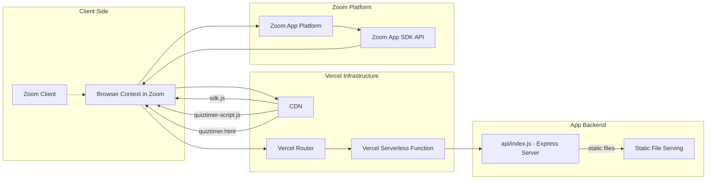

# Quiz Timer for Zoom - Architecture Diagram

## System Architecture Overview

## Data Flow Diagram

## Component Interaction Flow

1. **Initialization Flow**
   - User opens app in Zoom meeting
   - Zoom client requests HTML from server with app context header
   - Server serves HTML and required static assets
   - App initializes Zoom SDK and sets up drawing context

2. **Runtime Flow**
   - User interacts with timer UI
   - JavaScript app calls Zoom SDK APIs
   - SDK communicates with Zoom client
   - Timer image is drawn on video feed

3. **Authentication Flow**
   - If app requires authentication, redirects to Zoom OAuth
   - After successful authentication, redirects back to Zoom meeting context

## Deployment Architecture

## Key Components

- **Zoom App SDK**: Provides APIs for interacting with Zoom video rendering
- **Express.js Server**: Handles HTTP requests and serves static assets
- **Static Assets**: JavaScript, CSS, and HTML files for the application
- **Vercel Platform**: Deployment and hosting platform with CDN capabilities
- **Zoom Client**: The actual Zoom application running the app in a meeting
- **OAuth Integration**: For authentication with Zoom APIs if needed

## Security Considerations

- Server-side security headers (Helmet.js)
- Rate limiting for authentication endpoints
- Secure session handling
- Proper MIME type enforcement for static assets
- Context validation for Zoom app environment